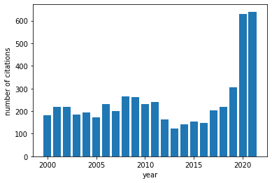
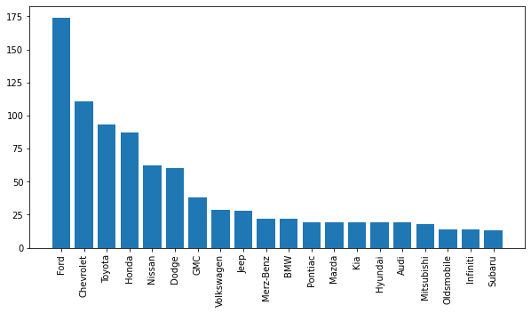
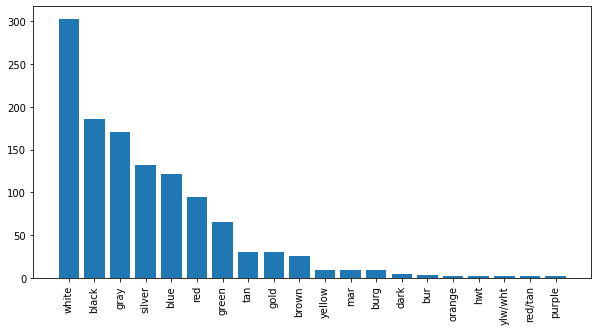

# paymycite-dump

I got a parking ticket in Sonoma County, so naturally I am now dumping a large random sample of real parking citations from their online database.

After dumping metadata about 5k citations, I computed some statistics on the data. The results can be found in this README at [Analysis of data](#analysis-of-data).

# How it works

The website [paymycite.com](paymycite.com) allows you to search a parking ticket using a combination of the issuing agency (e.g. "Sonoma County") and a six-digit citation number. After initial investigation, it looks like there are 166 valid agencies. Unfortunately, it seems that both fields need to be exactly correct for a search result to appear. This means that the total search space has roughly `166*10^6 = 166,000,000` permutations.

After some initial searching, one can compute some statistics about the search space. A random query has roughly `0.00786` probability of a hit, so we must check about 130 random records to uncover a valid one. From this we can estimate that there are about 1.3M records to be found in total.

For some citations, the website also provides a way to contest the citation. The page for this displays a lot of extra metadata, like the address where the citation occurred and the nature of the violation. Note that this metadata can be fetched without actually submitting the form.

# Analysis of data

I've performed some [analysis](analysis/stats.ipynb) on an initial dump of 5K citations.

The website seems to have records dating back to the year 2000. We can look at how the number of records vary from year to year. For some reason, 2020 and 2021 have many more citations, either because the database gets cleaned out over time as people pay citations, or perhaps the pandemic caused a legitimate uptick in parking violations.



The database also contains metadata about the offending vehicles. Here, we can look at a histogram of car manufacturers:



Additionally, we can look at car colors. Nothing too surprising here:



So what are the most common violations in the database? This is hard to quantify since some violations go by many different names, but here's a first attempt at it:

```
69 street sweeping
52 expired tags
50 non payment of day use fees
47 no parking zone
34 posted no parking - street sweeping
32 no permit displayed
30 all night parking
22 posted "no parking"
22 expired registration
21 not w/in designated parking space
```

In that list, we can already see that street sweeping is counted separately by two different descriptions. I'm surprised that something like "meter expired" isn't on this list. Maybe it goes by many different names in the tail of the distribution.

# Running

First, you can randomly scan for citation data using the `find_cites` script, which will continually dump citations as they are found:

```
go run ./find_cites
```

This will continually write to a CSV file `output.csv` with these columns:

 * agency
 * citation number
 * agency name
 * license plate
 * state
 * date
 * total fine
 * notes (usually just empty or a phone number)

Some citations have additional metadata available through a "contest" form, such as an address and violation code. To fill in this info, run the `fetch_details` script like so (after running `find_cites`):

```
go run ./fetch_details
```

This script goes through records in `output.csv` and writes augmented records to a file `details.csv`. The resulting CSV has a header row listing all of the field names.
